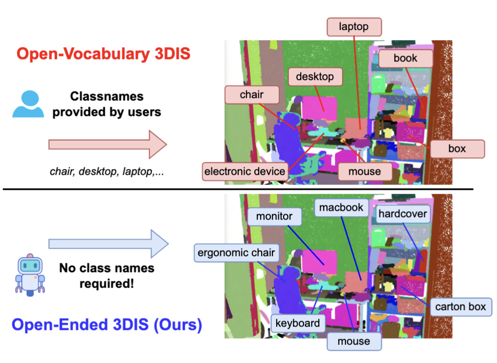

##### Table of contents
1. [Installation guide](#Installation_guide)
2. [Data Preparation](#Data_Preparation) 
3. [Run the code](#Run_the_code)
4. [Acknowledgments](#Acknowledgments)

# Open-Ended 3D Point Cloud Instance Segmentation [ICCV'25 - OpenSUN3D](https://iccv.thecvf.com/)

by [Phuc Nguyen](https://phucnda.github.io/), [Minh Luu](https://minhluu2911.github.io/), [Anh Tran](https://scholar.google.com/citations?user=FYZ5ODQAAAAJ&hl=en), [Cuong Pham](https://sites.google.com/view/cuongpham/home) and [Khoi Nguyen](https://www.khoinguyen.org/)

## News :zap:
* **Jul 2025**: We release the source code for OE-3DIS

* **Jul 2025**: OE-3DIS is accepted to the [ICCV 2025 - OpenSUN3D](https://iccv.thecvf.com/)

* **Aug 2024**: OE-3DIS released on [arxiv](https://arxiv.org/abs/2408.11747)

<a href="https://arxiv.org/abs/2408.11747"></a>

</div>


> **Abstract**: 
Open-vocabulary 3D Instance Segmentation methods (OV-3DIS) have recently demonstrated their generalization ability to unseen objects. However, these methods still depend on predefined class names during inference, restricting agents' autonomy. To mitigate this constraint, we propose a novel problem termed Open-Ended 3D Instance Segmentation (OE-3DIS), which eliminates the necessity for predefined class names during testing. We present a comprehensive set of strong baselines inspired by OV-3DIS methodologies, utilizing 2D Multimodal Large Language Models. In addition, we introduce a novel token aggregation strategy that effectively fuses information from multiview images. To evaluate the performance of our OE-3DIS system, we benchmark both the proposed baselines and our method on two widely used indoor datasets: ScanNet200 and ScanNet++. Our approach achieves substantial performance gains over the baselines on both datasets. Notably, even without access to ground-truth object class names during inference, our method outperforms Open3DIS, the current state-of-the-art in OV-3DIS.



Details of the model architecture and experimental results can be found in [our paper](https://arxiv.org/abs/2408.11747):
```bibtext EDITING
@article{nguyen2024open,
  title={Open-ended 3d point cloud instance segmentation},
  author={Nguyen, Phuc DA and Luu, Minh and Tran, Anh and Pham, Cuong and Nguyen, Khoi},
  journal={arXiv preprint arXiv:2408.11747},
  year={2024}
}
```
**Please CITE** our paper whenever this repository is used to help produce published results or incorporated into other software.

## Features :mega:
* Optimized source code for 2D-3D VLM inference
* Reproducibility code for ScanNet200, Scannet++ datasets!
* 2D segmenter: Support SAM, Detic!


## Installation guide :hammer:

Environment: 

```
pip install torch==2.0.1 torchvision==0.15.2
pip install -r requirements.txt
```

VLM weight: [weights](https://drive.google.com/file/d/1ObaklM3NohoPIm_IaTde0RbCefZC8RtL/view?usp=drive_link)

Save it under:
```
../weights/osm_final.pt
```

## Data Preparation :open_file_folder:


At this moment, dueing to the license of Scannet, we provide an example processed set of Scannet200 (1 scene) + Scannetpp (50 validation scenes) here: [Scannet200](https://drive.google.com/file/d/1t2a5XQqkrauJo1iqheO0oJKQ8PeJBRR0/view?usp=sharing), [Scannetpp](https://drive.google.com/file/d/1p-cl_tpbxkgdgUJscixz5hVdMCntz__v/view?usp=sharing)

Please, follow Scannet and Scannet++ license to use our preprocessed dataset.

For Scannet200, we construct data tree directory as follow and consider only for validation set:

```
data
├── Scannet200
############## 2D root folder with default image sampling factor: 5 ##############
│    ├── Scannet200_2D_5interval 
│    │    ├── val                                       <- validation set
│    │    |    ├── scene0011_00
│    │    |    │    ├──color                            <- folder with image RGB
│    │    │    │    │    00000.jpg
│    │    │    │    │    ...
│    │    |    │    ├──depth                            <- folder with image depth
│    │    │    │    │    00000.png
│    │    │    │    │    ...
│    │    |    │    ├──pose                             <- folder with camera poses
│    │    │    │    │    00000.txt
│    │    │    │    │    ...
│    │    |    |    intrinsic.txt (image intrinsic)
│    │    |    ....
│    │    |    intrinsic_depth.txt (depth intrinsic)    <- Scannet intrinsic ~ depth img
│    │    ├── train
│    │    ├── test 
############## 3D root folder with point cloud and annotation ##############
|    ├── Scannet200_3D
│    │    ├── val                                       <- validation set
│    │    │    ├── original_ply_files                   <- the .ply point cloud file from Scannet raw data.
│    │    │    │     scene0011_00.ply
│    │    │    │     ...
|    │    │    ├── groundtruth                          <- normalized point cloud, color from PLY + ann (for 3D backbone)
|    │    │    │     scene0011_00.pth           
|    │    │    │     ...
|    │    │    ├── superpoints                          <- superpoints directory
|    │    │    │     scene0011_00.pth
|    │    │    │     ...
|    │    │    ├── isbnet_clsagnostic_scannet200        <- class agnostic 3D proposals
|    │    │    │     scene0011_00.pth
|    │    │    │     ...
|    │    │    ├── dc_feat_scannet200                   <- 3D deep feature of 3D proposals network
|    │    │    │     scene0011_00.pth
|    │    │    │     ...
│    │    ├── train
│    │    ├── test 
####################################################################################
```

1\) Generating RGB-D images, camera poses, original PLY, superpoints and inst_nostuff files

* Download the [ScannetV2 dataset](http://www.scan-net.org/)

* Please refer to [RGB-D images, camera poses and original PLY](https://github.com/ScanNet/ScanNet/tree/master/SensReader/python)

* Please refer to [Superpoints and inst_nostuff](https://github.com/VinAIResearch/ISBNet/tree/master/dataset/scannet200)


For Scannetpp, we construct data tree directory as follow and consider only for validation set:

```
data
├── Scannetpp
############## 2D root folder with default image sampling factor: 5 ##############
│    ├── Scannetpp_2D_5interval 
│    │    ├── val                                            <- validation set
│    │    |    ├── 0d2ee665be
│    │    |    │    ├──color                                 <- folder with image RGB
│    │    │    │    │    00000.jpg
│    │    │    │    │    ...
│    │    |    │    ├──depth                                 <- folder with image depth
│    │    │    │    │    00000.png
│    │    │    │    │    ...
│    │    |    │    ├──pose                                  <- folder with camera poses
│    │    │    │    │    00000.txt
│    │    │    │    │    ...
│    │    |    │    ├──intrinsic                             <- folder with intrinsic (In Scannet200, intrinsic same across all views)
│    │    │    │    │    00000.txt
│    │    │    │    │    ...
│    │    |    |    intrinsic.txt (image intrinsic)
│    │    |    ....
│    │    |    intrinsic_depth.txt (depth intrinsic)         <- Scannet intrinsic ~ depth img
│    │    ├── train
│    │    ├── test 
############## 3D root folder with point cloud and annotation ##############
|    ├── Scannetpp_3D
│    │    ├── val                                            
│    │    │    ├── original_ply_files                       <- the .ply point cloud file from Scannet raw data.
│    │    │    │     0d2ee665be.ply
│    │    │    │     ...
|    │    │    ├── groundtruth                              <- point cloud, color from PLY + annotation
|    │    │    │     0d2ee665be.pth           
|    │    │    │     ...
|    │    │    ├── superpoints                              <- superpoints directory
|    │    │    │     0d2ee665be.pth
|    │    │    │     ...
|    │    │    ├── isbnet_clsagnostic_scannet200            <- class agnostic 3D proposals
|    │    │    │     0d2ee665be.pth
|    │    │    │     ...
|    │    │    ├── dc_feat_scannetpp                        <- 3D deep feature of 3D proposals network
|    │    │    │     0d2ee665be.pth
|    │    │    │     ...
│    │    ├── train
│    │    ├── test 
####################################################################################
```

## Run the code :running:

*NOTE: The transformers version might affect the final results

Install InstructBLIP weight:
```
pip install --upgrade transformers
python3 from transformers import InstructBlipProcessor, InstructBlipForConditionalGeneration
```

1\) Top-1 Score Mask Open-Ended 3D Instance Segmentation

```
python run/freevocab_1n_average.py
```

2\) Maskwise Open-Ended 3D Instance Segmentation

```
python run/freevocab_1n_average_multiview.py
```

3\) Pointwise Open-Ended 3D Instance Segmentation

```
python run/freevocab_1n_pcfeature.py
```

4\) Evaluation protocol: We design an approach that uses Hungarian matching algorithm to match the predicted proposals with the corresponding groundtruths via language model to assess the performance of OE-3DIS

```
python evaluation/eval3d.py
```

## Acknowledgments

This repo is built upon [Open3DIS](https://github.com/VinAIResearch/Open3DIS), [OSM](https://github.com/bytedance/OmniScient-Model)

## Contacts

If you have any questions or suggestions about this repo, please feel free to contact me (phucnda@gmail.com).
